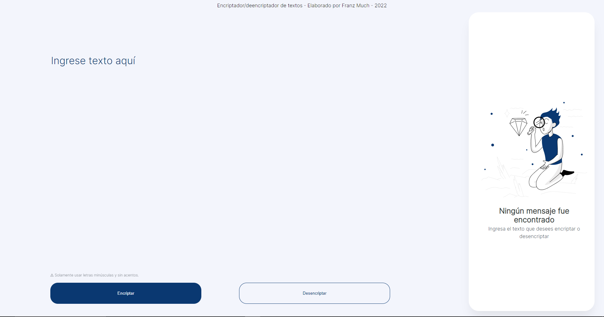
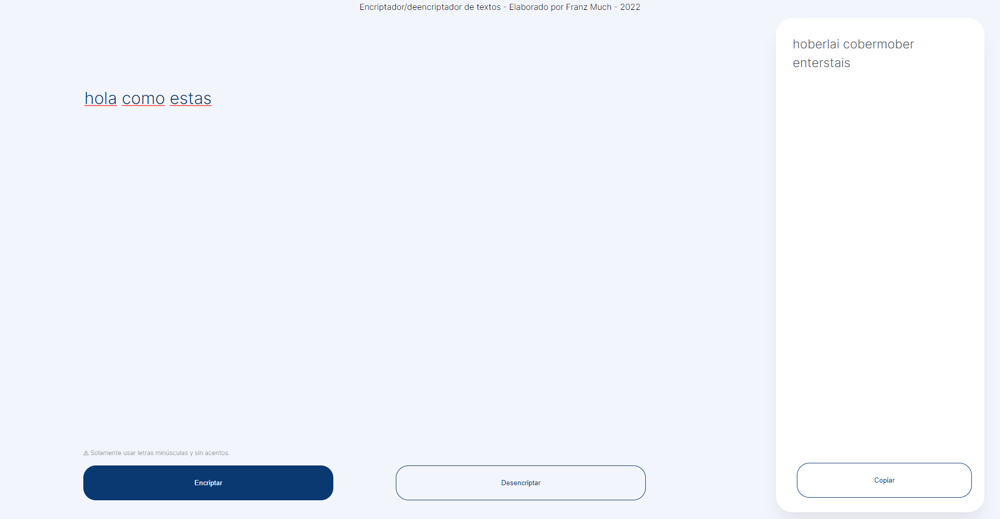

# INTRODUCCIÓN

Este proyecto "encripta" texto cambiando las vocales (a, e, i, o, u) por (ai, enter, imes, ober, ufat) y viceseversa si se busca desencriptar bajo este mismo formato. Para esto se necesita que el usuario ingrese texto en minúsculas y que no se utilicen carácteres especiales ni signos de puntuación.

# USO
## PANTALLA INICIAL

En la pantalla principal se muestra un área para introducir texto (textarea) y dos botones, "encriptar" y "desencriptar". Estos se encuentran del lado izquierdo de la pantalla. Del lado derecho, se muestra una sección donde se mostrará el texto encriptado o desencriptado (según sea el caso).

## ENCRIPTAR

Para encriptar texto se debe introducir un texto ordinario en donde se indica ("Ingrese texto aquí" de la imagen en la sección pantalla principal). Luego de ingresar este, se debe presionar el botón "Encriptar" que se muestra de color azul. El texto encriptado se mostrará del lado derecho de la pantalla en un área no modificable. También se encuentra un botón para poder copiar el texto, y así, poder introducirlo nuevamente para desencriptarlo o viceversa (en caso se desee encriptar un texto encriptado).

## DESENCRIPTAR

Para desencriptar texto se sigue la misma lógica que para encriptar. Se debe introducir el texto encriptado en el área "Ingrese texto aquí" y luego se debe presionar el botón "Desencriptar". El texto desencriptado se mostrará en el lado derecho de la pantalla junto con el botón "Copiar" mencionado en la sección anterior.

# CRÉDITOS

Creado como un challenge para la formación de Oracle Next Education (ONE). Elaborado por Franz Much, 2023.